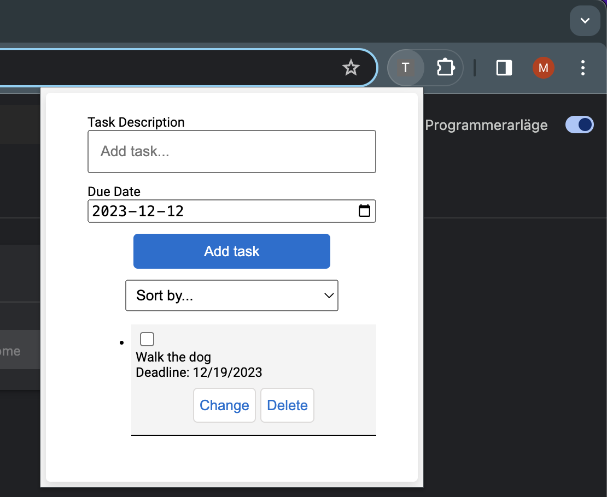

<div align="center">

# Task Manager / Chrome Extension

### Description
Small project made to try out creating chrome extensions.
<br>



### How to add it to extentions
```sh
1. Go into your chrome extensions.
2. Toggle developer mode.
3. Click "Load unpacked" and pick the files.
4. Enable the extension.
```

